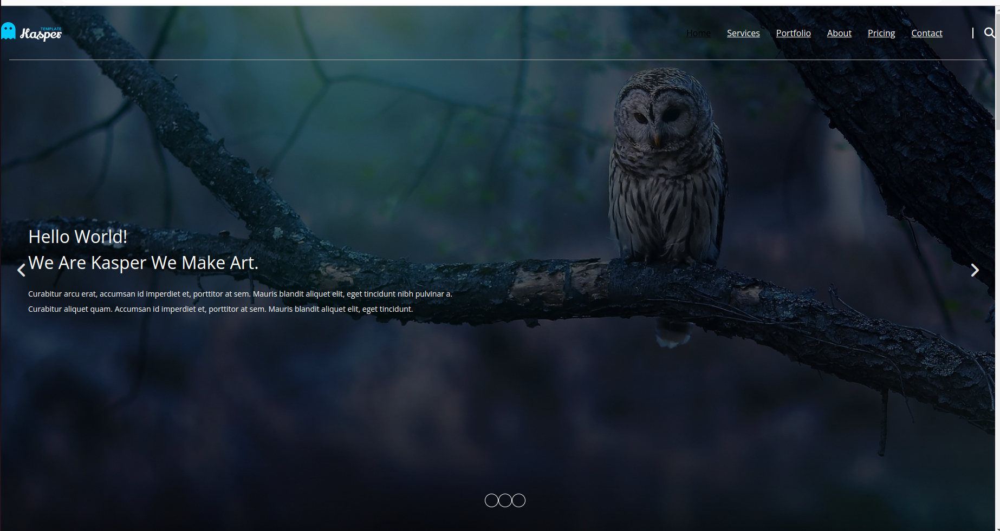
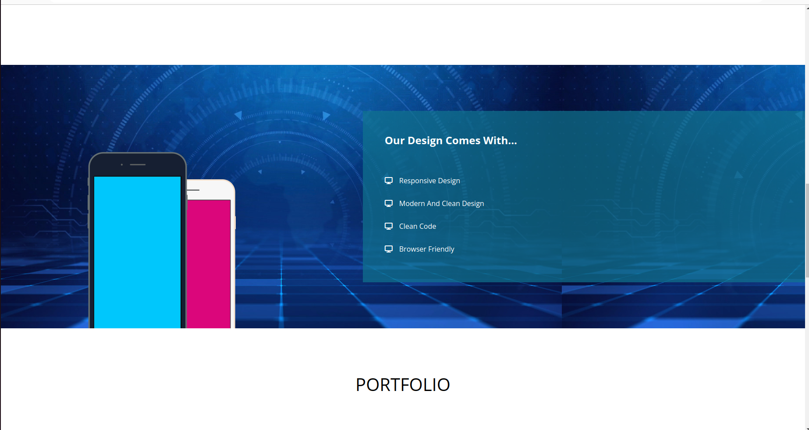
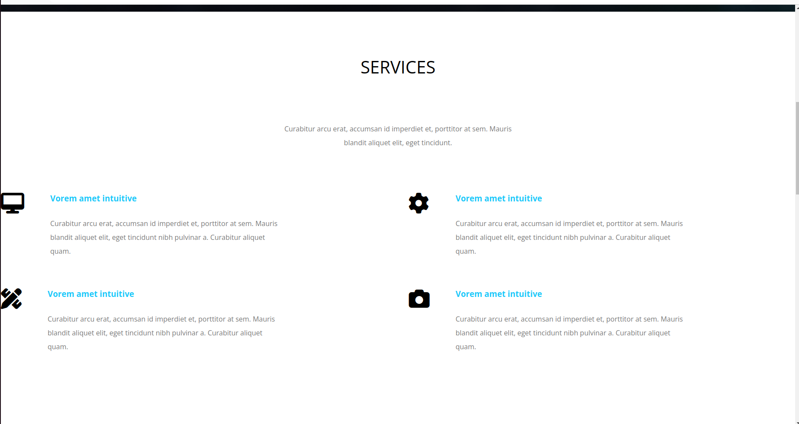
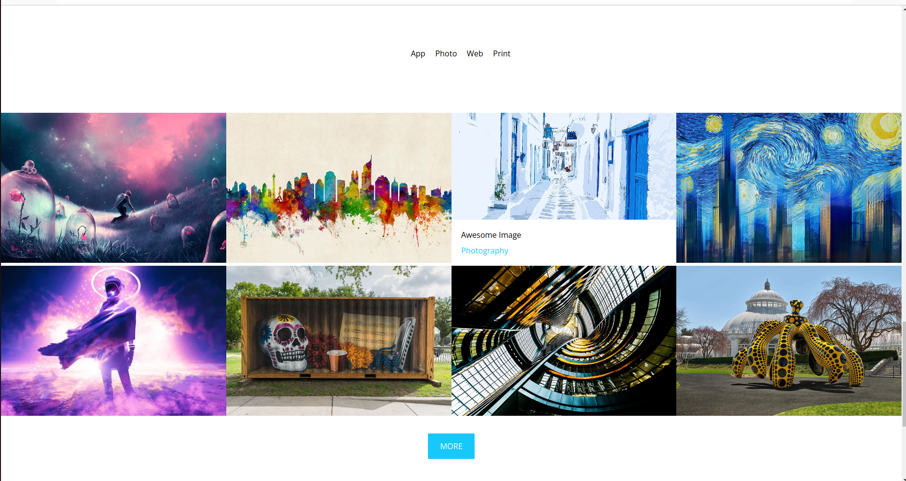

# Template
This is a project is a clone of Kasper Template using HTML and CSS 
# Screenshots
# Home 

# Features

# Services

# Portfolio

- Source Code URL: [here](https://github.com/a-guirat/Template)

### Built with
 

### CSS properties used
- Media Queries And Responsive Design
- Flexbox
- CSS Grid
- Position
- Mobile-first workflow

  # links 
)

[
